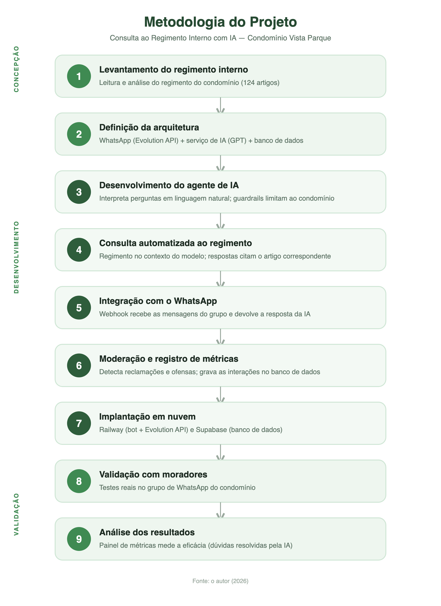

<div align="center">

# 🌿 Vista Parque — Assistente Virtual do Condomínio

**Consulta ao Regimento Interno com Inteligência Artificial, direto no WhatsApp.**

Um agente de IA que responde às dúvidas dos moradores sobre o regimento do condomínio em linguagem natural, registra reclamações, modera o grupo e entrega um painel de métricas para o síndico.


</div>

> 🎓 Projeto desenvolvido como **Atividade Extensionista** (UNINTER — CST em Análise e Desenvolvimento de Sistemas).
> ODS contempladas: **9 — Indústria, inovação e infraestrutura** e **16 — Paz, justiça e instituições eficazes**.

---

## 📖 Sobre o projeto

Em condomínios, dúvidas sobre as regras (pets, horário de silêncio, mudanças, vagas, etc.) se repetem o tempo todo e sobrecarregam o síndico. Este projeto resolve isso com um **assistente de IA dentro do grupo de WhatsApp dos moradores**: a pessoa pergunta com as próprias palavras e recebe a resposta **citando o artigo do regimento** — 24 horas por dia, sem depender da administração.

O sistema ainda **detecta e registra reclamações**, **modera mensagens ofensivas** e oferece um **painel web (PWA)** onde o síndico acompanha as métricas de eficácia.

---

## ✨ Funcionalidades

- 💬 **Consulta em linguagem natural** ao regimento, com **citação do artigo** (ex: *"conforme o Art. 96…"*).
- 🧠 **Guardrails**: responde **apenas** sobre o condomínio; se a dúvida não consta no regimento, **encaminha ao síndico** em vez de inventar.
- 🏷️ **Triagem automática** de cada mensagem: `pergunta` · `reclamação` · `ofensa` · `irrelevante`.
- 📣 **Registro de reclamações** por assunto, com confirmação automática ao morador.
- 🛡️ **Moderação conservadora**: sinaliza ofensas, **apaga só com alta confiança** (exige o bot admin do grupo) e avisa nos demais casos.
- 📊 **Painel do síndico (PWA)**: login, cartões de métricas, *gauge* de resolução, gráfico de atividade, donut de reclamações, histórico de conversas e **exportação em PDF**.
- ⚡ **Sem RAG**: o regimento inteiro cabe no contexto do modelo — mais simples, mais preciso e com *prompt caching*.

---

## 🗺️ Metodologia



---

## 🏛️ Arquitetura

```
   Morador no grupo WhatsApp
            │  (mensagem)
            ▼
 ┌──────────────────────┐   webhook    ┌──────────────────────────┐
 │     Evolution API     │ ───────────► │   Bot (Node + Express)    │
 │  (Docker · WhatsApp)  │ ◄─────────── │  • triagem (classifica)   │
 │                       │  envia/apaga │  • resposta + guardrails  │
 └──────────┬───────────┘              │  • moderação + métricas   │
            │                          │  • painel /painel (PWA)   │
   Postgres + Redis                    └────────────┬─────────────┘
   (sessão da Evolution)                            │
                                                    ▼
                                          OpenAI · gpt-4o-mini
                                    (regimento no system prompt,
                                       só na resposta a perguntas)
                                                    │
                                                    ▼
                                       Postgres (logs e métricas)
```

**Fluxo:** toda mensagem do grupo passa por uma **classificação barata** (sem o regimento). Só quando é uma **pergunta** o bot faz a 2ª chamada — essa sim com o regimento inteiro no *system prompt* (e *prompt caching* da OpenAI nas repetições).

---

## 🧰 Stack

| Camada | Tecnologia |
|---|---|
| Runtime | **Node.js 24** (ESM, JavaScript puro) |
| API/Servidor | **Express 5** |
| IA | **OpenAI** `gpt-4o-mini` |
| Banco | **PostgreSQL** (Supabase / Railway) via `pg` |
| WhatsApp | **Evolution API v2.3.7** (Baileys) + Redis |
| Frontend | HTML/CSS/JS puro + **Chart.js** · **PWA** |
| Testes | `node:test` (nativo) |
| Deploy | **Railway** (bot + Evolution + Postgres + Redis) |

---

## 📁 Estrutura

```
condominio-ai/
├── src/
│   ├── server.js              # Express: webhook, painel e API
│   ├── config.js              # leitura/validação de variáveis de ambiente
│   ├── ai/
│   │   ├── client.js          # cliente OpenAI
│   │   ├── classify.js        # classificação da mensagem (prompt pequeno)
│   │   └── answer.js          # resposta com o regimento + guardrails
│   ├── triage/
│   │   ├── handle.js          # orquestra o que fazer com cada mensagem
│   │   └── mention.js         # detecção de "o bot foi chamado"
│   ├── moderation/
│   │   ├── profanity.js       # pré-filtro de palavrão (regex)
│   │   └── decide.js          # decisão (apagar/avisar) conservadora
│   ├── whatsapp/
│   │   ├── parse.js           # extrai dados do webhook da Evolution
│   │   └── evolution.js       # enviar texto / apagar mensagem
│   ├── db/
│   │   ├── pool.js · migrate.js · repo.js
│   │   ├── relatorio.js       # agregações de métricas
│   │   └── consultas.js       # listagens e série temporal
│   └── painel/auth.js         # autenticação do painel (token HMAC)
├── public/
│   ├── painel.html            # dashboard (PWA, single-file)
│   ├── manifest.json · icon*.png · icon.svg
├── data/regimento.md          # texto integral do regimento interno
├── db/schema.sql              # tabelas (mensagens_log, reclamacoes, infracoes)
├── docs/                      # diagrama da metodologia, planos de design
└── Dockerfile
```

---

## 🚀 Como rodar localmente

```bash
# 1. Dependências
pnpm install

# 2. Variáveis de ambiente
cp .env.example .env       # preencha as chaves (veja a tabela abaixo)

# 3. Testes (lógica pura, sem rede)
pnpm test

# 4. Subir o servidor
pnpm dev                   # com --watch
# ou
pnpm start
```

As tabelas do banco são criadas **automaticamente no boot** (`CREATE TABLE IF NOT EXISTS`). Para aplicar manualmente:

```bash
psql "$DATABASE_URL" -f db/schema.sql
```

---

## 🔐 Variáveis de ambiente

| Variável | Descrição |
|---|---|
| `PORT` | Porta do servidor (padrão `3000`) |
| `OPENAI_API_KEY` | Chave da OpenAI |
| `OPENAI_MODEL` | Modelo (padrão `gpt-4o-mini`) |
| `DATABASE_URL` | Connection string do Postgres (use o **pooler** do Supabase) |
| `EVOLUTION_BASE_URL` | URL pública da Evolution API |
| `EVOLUTION_API_KEY` | Chave de autenticação da Evolution |
| `EVOLUTION_INSTANCE` | Nome da instância (ex: `condominio`) |
| `EVOLUTION_BOT_JID` | JID do número do bot (`55DDDNUMERO@s.whatsapp.net`) |
| `BOT_TRIGGERS` | Palavras que acionam o bot (padrão `zelador,sindico,bot`) |
| `MODERATION_DELETE_THRESHOLD` | Confiança mínima p/ apagar ofensa (padrão `0.85`) |
| `PAINEL_SENHA` | Senha de acesso ao painel do síndico |
| `PAINEL_SECRET` | String aleatória para assinar o token do painel |

---

## 🌐 Endpoints

| Método | Rota | Descrição |
|---|---|---|
| `GET` | `/health` | Healthcheck |
| `POST` | `/webhook` | Recebe os eventos da Evolution API |
| `GET` | `/painel` | Painel do síndico (PWA) |
| `POST` | `/api/login` | Login do painel (retorna token) |
| `GET` | `/api/metricas` | Métricas agregadas 🔒 |
| `GET` | `/api/conversas` | Histórico de conversas 🔒 |
| `GET` | `/api/reclamacoes` | Reclamações registradas 🔒 |
| `GET` | `/api/infracoes` | Infrações moderadas 🔒 |
| `GET` | `/api/serie` | Série diária (gráfico de atividade) 🔒 |

🔒 = protegido por token (header `Authorization: Bearer <token>`).

---

## ☁️ Deploy (Railway + Supabase)

1. **Banco**: criar Postgres (Supabase ou Railway) e copiar a connection string.
2. **Evolution API**: serviço Docker `evoapicloud/evolution-api:v2.3.7` no Railway, com **Postgres + Redis** (o Redis é necessário para as sessões de criptografia).
3. **Bot**: deploy deste repositório (usa o `Dockerfile`) com as variáveis do `.env.example`.
4. **Parear o chip**: criar a instância, escanear o QR Code com um **número de teste** e configurar o webhook apontando para `https://<bot>/webhook` (evento `messages.upsert`).
5. **Grupo**: adicionar o bot ao grupo e **promovê-lo a administrador** (necessário para apagar mensagens).

---

## 🧪 Testes

```bash
pnpm test
```

Cobrem a lógica pura do sistema (classificação de chamada, pré-filtro de palavrão, decisão de moderação, parsing do webhook e orquestração da triagem) — sem dependência de rede.

---

## 💡 Decisões técnicas (e aprendizados)

- **Sem RAG.** Um regimento de ~50 páginas cabe no contexto do `gpt-4o-mini`. Mandar o documento inteiro no *system prompt* é mais simples e preciso que montar busca vetorial.
- **Guardrails primeiro.** A IA só responde sobre o condomínio, cita a fonte e escala ao síndico quando não há resposta no regimento — evitando alucinações.
- **Evolution v2.3.7 + Redis.** A versão 2.2.3 não enviava a grupos por causa do novo identificador `@lid` do WhatsApp; a 2.3.7 + cache Redis resolveu.
- **Moderação conservadora.** Lista de palavrões enxuta + limiar de confiança evitam falsos positivos (ex: "lixo" como reclamação legítima).

---

## 📄 Licença

Projeto acadêmico. Uso livre para fins educacionais.

<div align="center">
<sub>Feito com 🌿 para o Condomínio Vista Parque · 2026</sub>
</div>
